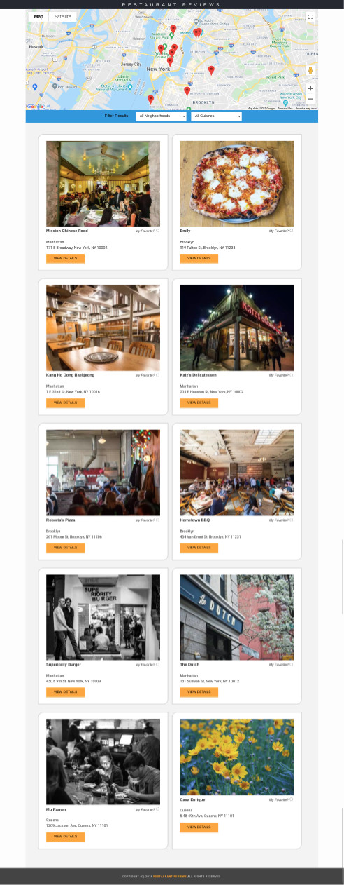

# Restaurant Review

[visit project live](https://review-resto-live.herokuapp.com/)

## WHAT IT DOES

The site allows users to check restaurants in selected New York City neighborhood.
Users can rate the restaurant and write reviews.

BUILT WITH:
-----------
- Pure JavaScript
- Node
- DOM
- CSS

## Project requirements

- PWA (Proressive Web App)
  . available offline
  . background sync
- Accessibility
- Responsive

## Project Overview

For the Restaurant Reviews projects, you will incrementally convert a static webpage to a mobile-ready web application. In Stage Three, you will take the connected application you built in Stage One and Stage Two and add additional functionality. You will add a form to allow users to create their own reviews. If the app is offline, your form will defer updating to the remote database until a connection is established. Finally, you’ll work to optimize your site to meet even stricter performance benchmarks than the previous project, and test again using Lighthouse.

## Specification

You will be provided code for an updated Node development server and a README for getting the server up and running locally on your computer. The README will also contain the API you will need to make JSON requests to the server. Once you have the server up, you will begin the work of improving your Stage Two project code.

This server is different than the server from stage 2, and has added capabilities. Make sure you are using the Stage Three server as you develop your project. Connecting to this server is the same as with Stage Two, however.

You can find the documentation for the new server in the README file for the server.

Now that you’ve connected your application to an external database, it’s time to begin adding new features to your app.

Requirements
Add a form to allow users to create their own reviews: In previous versions of the application, users could only read reviews from the database. You will need to add a form that adds new reviews to the database. The form should include the user’s name, the restaurant id, the user’s rating, and whatever comments they have. Submitting the form should update the server when the user is online.

Add functionality to defer updates until the user is connected: If the user is not online, the app should notify the user that they are not connected, and save the users' data to submit automatically when re-connected. In this case, the review should be deferred and sent to the server when connection is re-established (but the review should still be visible locally even before it gets to the server.)

Meet the new performance requirements: In addition to adding new features, the performance targets you met in Stage Two have tightened. Using Lighthouse, you’ll need to measure your site performance against the new targets.

Progressive Web App score should be at 90 or better.
Performance score should be at 90 or better.
Accessibility score should be at 90 or better.

## HOW TO RUN THE PROJECT:

The project is split in 2 parts:

1/ Backend API (not part of this project)
---------
Stand up the backend server by following the instructions [here:](https://github.com/udacity/mws-restaurant-stage-3)

2/ Frontend
-----------
- clone or download the project to your local machine
- from the project directory start the local server by running simpleServer:
  $~ python3 -m http.server 8888
    (change the port number to suit your local environment)
  (or in Visual Studio Code launch Live Server)
- open http://localhost:[PORT in 2/2 - above]

You should be able to check out restaurants, leave comments, even when offline